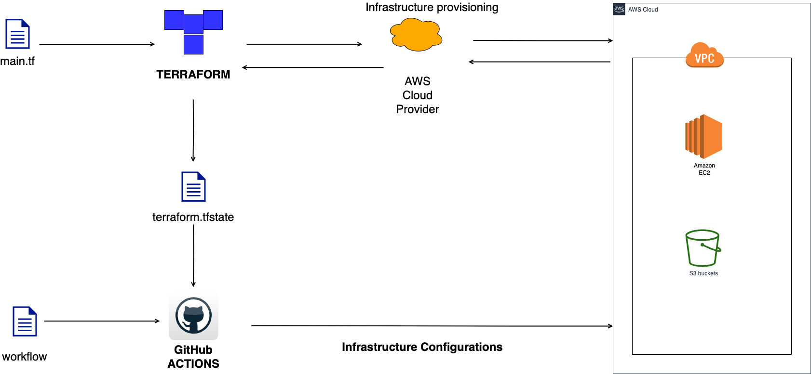

Šis ir projekts FITA Devops kursa noslēgumam.

# Uzdevumi 

Projektā tika izveidots GitHub repositorijs, kurā ievietoti faili, kas automatizē AWS EC2 instances izveidošanu ar terraform, S3 bucketa izveidošanu, Docker instalāciju ar Github Actions. 

Izveidotajā EC2 instancē tika instalēts Docker un izveidots Docker image, kas pēc tam tiek palaists konteinerī. 
Tāpat Docker image tiek kopēts DockerHub. 
***
## Šeit ilustrēta infrastruktūra: 

***
### Detalizēta uzdevumu izpilde atzīmēta un aprkastīta Wiki [DONE](https://github.com/cepums159/final_work/wiki/DONE) sadaļā. 
